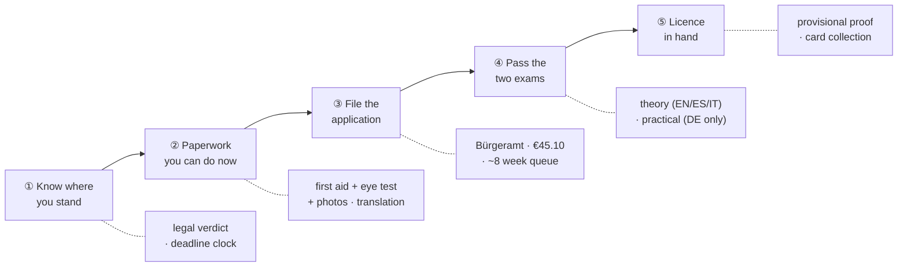
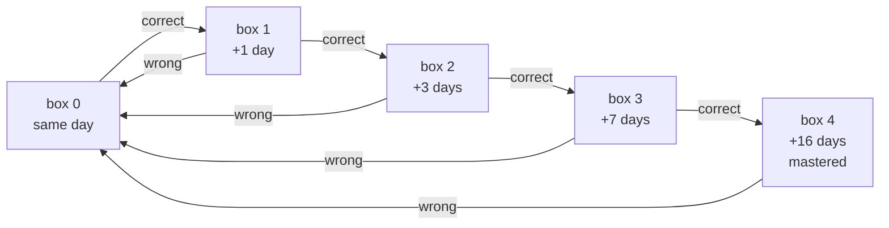
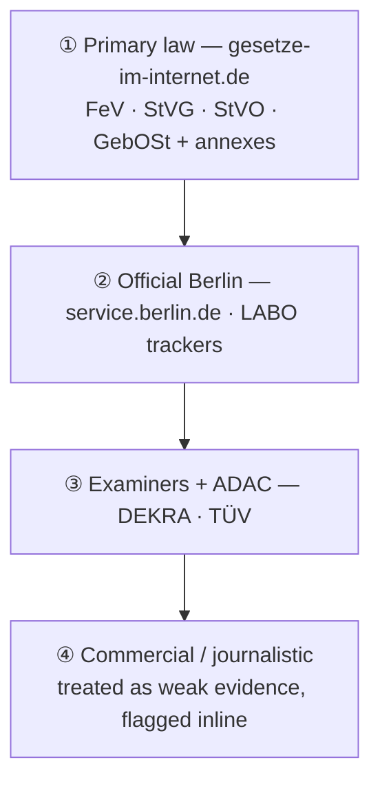

<div align="center">


# 🚦 Führerschein Hero

### Get a German driving licence in Berlin — in English, without guessing

**A gamified, offline-capable study and logistics companion for converting a non-EU driving licence
into a German one, and for passing the class B theory exam.**
No build step. No backend. No accounts. No tracking. Every legal claim sourced.

<br>


<br>


<br>

**[Quick start](#-quick-start) · [Features](#-whats-inside) · [Accuracy](#-accuracy-the-part-that-actually-matters) · [Security](#-security--privacy) · [Testing](#-testing) · [Architecture](#-architecture) · [Deployment](#-deployment)**

<br>


</div>

---

## 🧭 What this is

Moving to Germany with a non-EU driving licence starts a clock most people don't know is running.
Under **§ 29 Abs. 1 Satz 4 FeV** a foreign licence is recognised for **six months** after you
establish ordinary residence. After that, driving on it is not a paperwork problem — it is
*Fahren ohne Fahrerlaubnis*, a criminal offence under **§ 21 StVG**.

Meanwhile the actual conversion involves a first-aid course, an eye test, a certified translation,
a driving school, a *Prüfauftrag*, two exams, and an authority queue measured in weeks — described
almost entirely in German, across a dozen unconnected websites.

**Führerschein Hero collapses that into one guided route**: what to do next, why it is legally
required, where to physically go in Berlin, how long you have left, and a full theory course in
English so the exam isn't the thing that stops you.

> [!IMPORTANT]
> This is a **study and planning aid, not legal advice**. Fees, waiting times and provider prices
> change. Always confirm your own case with LABO Berlin before spending money. See
> [Legal disclaimer](#-legal-disclaimer).

### Who it's for

| You hold… | What the app does | Route |
|---|---|---|
| 🌍 **A non-EU licence** (Argentina is the worked example) | Tracks the six-month recognition deadline, walks the full *Umschreibung* under **§ 31 FeV**, and trains you for **both** mandatory exams | **5 phases · 12 tasks** |
| 🇪🇺 **An EU/EEA licence** | Explains why it stays valid with no exam, and the narrow cases where exchange becomes mandatory | 1 phase · 1 task |
| 🚫 **No licence at all** | Points at the *Ersterteilung* route from scratch, sharing the same exam machinery | 1 phase · 1 task |

> The non-EU conversion route is the one built out in depth. The other two are honest signposts,
> not full guides — see [Non-goals](#-non-goals--roadmap).

---

## ⚡ Quick start

There is **no build step and nothing to install**. It is hand-written ES modules and CSS — serve
`src/` with any static file server and open it.

```bash
git clone git@github.com:agusgonzaleznic/german-driving-school.git
cd german-driving-school
npm run dev            # python3 -m http.server 4173 -d src
# → open http://localhost:4173
```

That's it. No bundler, no transpiler, no framework, no `npm install` needed to *run* it
(`npm install` only fetches `playwright-core` for the browser tests).

<details>
<summary><b>Other ways to serve it</b></summary>

```bash
npm run dev:node                  # npx serve -l 4173 src
python3 -m http.server 4173 -d src
npx http-server src -p 4173
php -S localhost:4173 -t src
```

Any static host works too — see [Deployment](#-deployment).

**One requirement:** serve it over `http(s)://`, not `file://`. ES modules and `fetch()` of the
JSON data files are blocked by the `file:` origin.

</details>

<details>
<summary><b>Does it work offline?</b></summary>

Almost entirely. All content, logic, icons and road-sign artwork are local. Three things reach the
network, and each degrades gracefully instead of breaking:

| Resource | Host | If blocked |
|---|---|---|
| Map tiles | `tile.openstreetmap.org` | Map area shows a fallback; the place list, addresses and links still work |
| Leaflet 1.9.4 | `unpkg.com` (SRI-pinned) | `renderMap()` detects the missing global and renders the list-only view |
| Cinzel + DM Sans | `fonts.gstatic.com` | Every rule has a local fallback stack |

No content, progress or personal data is ever fetched or sent.

</details>

---

## 📦 What's inside

<div align="center">

| | | |
|:--:|:--:|:--:|
| **169**<br>exam-style questions | **11**<br>theory modules | **12**<br>real-world tasks |
| **64**<br>glossary terms | **51**<br>examiner phrases | **35**<br>Berlin locations |
| **36**<br>road-sign SVGs | **17**<br>badges · **10** levels | **~59.5k**<br>words of sourced research |

</div>

### 🗺️ The journey — logistics, not just study

The conversion route is modelled as five phases you walk in order. Each task carries the statutory
basis, the real cost, what to physically bring, and where to go.



**The deadline clock is the feature that justifies the app.** Given an *Anmeldung* date it computes
the recognition end date from `src/data/rules.json` and escalates as it closes:

| Tier | Trigger | Framing |
|---|---|---|
| 🟢 `plan` | > 150 days | Time to plan properly |
| 🟡 `urgent` | ≤ 90 days | Start now — the authority alone takes ~8 weeks |
| 🔴 `critical` | ≤ 30 days | You are about to lose the right to drive |

> [!NOTE]
> **`licenceClock()` returns `null` rather than guessing.** If the app cannot source a recognition
> period for your licence country, it says so and shows nothing. No invented deadline ever reaches
> the screen — see [Accuracy](#-accuracy-the-part-that-actually-matters).

### 🎓 The theory course

Eleven modules written in English, each ending in a quiz drawn from the same pool as the mock exam.

| Module | Title | Questions |
|---|---|:--:|
| `m01-system` | The System & You | 15 |
| `m02-signs` | Traffic Signs & Road Markings | 15 |
| `m03-priority` | Right of Way & Intersections | 16 |
| `m04-speed` | Speed, Distance & Stopping | 16 |
| `m05-overtaking` | Overtaking, Turning & Manoeuvres | 15 |
| `m06-vulnerable` | People Outside Your Car | 15 |
| `m07-autobahn` | Autobahn & Country Roads | 15 |
| `m08-conditions` | Night, Weather & Hazard Perception | 15 |
| `m09-parking` | Parking, Stopping & Securing | 15 |
| `m10-vehicle` | Your Car: Tech, Load & Eco | 20 |
| `m11-berlin` | Berlin Survival Pack | 12 |

<div align="center">
 
</div>

### 🔁 Spaced repetition (Leitner)

Every question carries a box. Right answers promote, wrong answers reset to box 0.



A practice session reserves **30 %** of its slots (`FRESH_RATIO`) for never-seen questions, so
review backlog can never starve new coverage. Daily goal: **15** answers.

### 📋 The mock exam implements the *real* rules

Most free trainers just count a percentage. This one reproduces the official class B format,
including the rule that fails most people by surprise.

| Rule | Implementation |
|---|---|
| Question count | **30** — 20 *Grundstoff* + 10 *Zusatzstoff* |
| Scoring | **Error points**, weighted 2 / 3 / 4 / 5 per question — not a percentage |
| Pass threshold | **≤ 10** error points |
| ⚠️ Automatic fail | **Two wrong 5-point questions = failed**, even at 10 points or fewer |
| Multi-answer | A partially-correct multi-answer question scores **zero** — all or nothing |

> [!WARNING]
> That automatic-fail rule is the single most commonly missed fact about the German theory exam.
> `scoreExam()` enforces it, and `tests/scoring.test.mjs` asserts it in both directions.

**Readiness is deliberately hard to satisfy.** `examReadiness()` weights module mastery **0.45**,
mock-exam performance **0.40** and pool coverage **0.15** — and refuses to report "ready" without at
least **two passes in your last three attempts**, however high the arithmetic gets.

<div align="center">
 
</div>

### 🗣️ Examiner German

The theory exam can be taken in **12 languages** (*Anlage 7 Nr. 1.3 FeV*, English/Spanish/Italian
among them). **The practical cannot** — it is German-only, and no interpreter is permitted. So the
app drills the ~50 phrases an examiner actually says, grouped by manoeuvre.

### 📍 Berlin places

35 verified locations — free eye tests, English first-aid courses, photo booths, *Bürgerämter*,
DEKRA/TÜV *Prüfstellen*, driving schools — on a Leaflet map with an accessible list fallback.

> **Geolocation is opt-in, used only to sort the list locally, and never stored or transmitted.**
> The default view is central Berlin.

<div align="center">
 
</div>

### 🏆 Gamification

XP for every lesson, correct answer, task and exam; **10** levels with German driver titles.

| Lv | XP | Title | English |
|:--:|--:|---|---|
| 1 | 0 | Fußgänger | Pedestrian |
| 2 | 100 | Beifahrer | Passenger |
| 3 | 250 | Fahrschüler | Student Driver |
| 4 | 500 | Parkplatz-Profi | Parking-Lot Pro |
| 5 | 900 | Kreuzungs-Kenner | Junction Genius |
| 6 | 1400 | Stadtverkehr-Stratege | City-Traffic Strategist |
| 7 | 2000 | Landstraßen-Legende | Country-Road Legend |
| 8 | 2800 | Autobahn-Ass | Autobahn Ace |
| 9 | 3800 | Prüfungs-Profi | Exam Pro |
| 10 | 5000 | Führerschein-Held | Licence Hero |

Plus **17 badges** (all reachable — asserted by a test), day streaks that **decay honestly** when
lapsed instead of silently freezing, and a four-tier celebration hierarchy so passing a mock exam
feels different from answering one question right. All animation respects
`prefers-reduced-motion`.

<div align="center">

<br><sub>Responsive down to 390 px — measured, not assumed</sub>
</div>

---

## 🎯 Accuracy: the part that actually matters

A study app that invents a legal deadline is worse than no app. The governing constraint of this
project was: **assume freely about implementation, never about content.**

### Sources-first hierarchy

Research ran under a strict precedence rule, and statutory claims had to quote the German text
verbatim rather than paraphrase it:



### Adversarial verification

Each research domain was then handed to a **separate verifier that had not seen the research and
was instructed to refute rather than confirm** — go back to the primary source, re-read it, record
a per-claim verdict. Where the verifier corrected the researcher, the correction won.

That framing is what caught the errors that mattered:

| Claim that didn't survive | Reality |
|---|---|
| "You must convert within three years" | **No such rule exists** anywhere in FeV §§ 28–31 or Anlage 11 — a widely repeated phantom deadline |
| First aid course €59.99 | **€72.99** online (€82.99 cash on the day) |
| Eye test costs a fee | **Fee abolished in 2019** — free at major opticians |
| The *Prüfbescheinigung* lets you drive | **Dangerous misreading** — it does not |
| EU Directive 2025/2205 "changes nothing until 2029" | **Staggered** — 2027, 2028 *and* 2029 (Art. 29) |
| Convert in Italy instead | Barred by **§ 28 Abs. 4 Satz 1 Nr. 8 FeV** |

### The honesty rules, enforced in code

- **Legal periods live in [`src/data/rules.json`](src/data/rules.json)** and are never hardcoded in
  logic. If a period is absent, the UI shows nothing rather than a plausible number.
- Claims that could not be confirmed against a primary source are marked **⚠️ unverified** at the
  point of use rather than quietly dropped.
- **Not every verification pass completed.** Three research files have no verifier counterpart, and
  the documents say so explicitly instead of implying full coverage.
- `tests/data.test.mjs` asserts data integrity — every question has exactly one correct-answer set,
  every task references a real phase, every badge is reachable.

Full methodology, per-claim verdicts and the raw agent output:
**[`docs/knowledge-base/`](docs/knowledge-base/)**.

---

## 🔒 Security & privacy

Full audit: **[`docs/security.md`](docs/security.md)**.

There is no backend, no account, no analytics, no cookies and no error reporting. All state is
`localStorage`. That removes most of the usual attack surface — but not all of it, because the app
has an import button and builds every view from template literals.

| Finding | Severity | Fix |
|---|---|---|
| **Prototype pollution** via progress import — `Object.assign(state, JSON.parse(json))` let `__proto__` through, verified empirically | High | `sanitizeState()` allowlist that never copies `__proto__` / `constructor` / `prototype` |
| **Type confusion** via import — `badges: "ignition"` made `.includes()` do substring matching; `exams: {}` threw mid-render, blanking the screen with no recovery | High | Per-key coercion, clamped counts, capped collection and string sizes |
| **`javascript:` URLs** in data-driven `href`s — `esc()` escapes quotes, it does not neutralise a URL scheme | Medium | `safeUrl()` scheme allowlist; strips control characters first, so `java\nscript:` cannot slip past |
| **Partial escaping** in `icon()` / `emblem()` / `flag()` / `glyph()` | Medium | Full `&<>"'` escaping in all four rendering primitives |
| **No CSP** | Medium | Strict policy — the app has *zero* inline `<script>`, so `script-src` is genuinely tight |
| **No SRI on Leaflet** | Medium | `sha384` hashes computed from the actual 1.9.4 bytes |
| **Referrer leakage** to authority sites | Low | `no-referrer` document-wide + `rel="noopener noreferrer"` on every external link |

```
Content-Security-Policy:
  default-src 'self'; script-src 'self' https://unpkg.com;
  style-src 'self' 'unsafe-inline' https://unpkg.com https://fonts.googleapis.com;
  font-src 'self' https://fonts.gstatic.com;
  img-src 'self' data: https://tile.openstreetmap.org https://*.tile.openstreetmap.org;
  connect-src 'self'; object-src 'none'; base-uri 'none'; form-action 'none'
```

Verified by a dedicated test: **0 CSP violations**, Leaflet still initialises, tiles still fetch,
both fonts still load.

<details>
<summary><b>Two caveats worth reading</b></summary>

- **`style-src 'unsafe-inline'` is still needed** — the views use `style=""` attributes throughout.
  Style injection cannot execute script under this CSP, so the payoff for removing it is low.
- **The audit had one pair of eyes.** The five adversarial agent lenses intended for it failed twice
  on API capacity errors, so it was done directly instead: a mechanical sweep of all 475 template
  interpolations reaching `innerHTML`, plus manual review of the import path, network surface and
  third-party dependency. `docs/security.md` says so at the top rather than implying more rigour
  than it had.
- **Your exported progress file contains what you typed** (name, *Anmeldung* date, licence country),
  and the same data sits in `localStorage`. On a shared computer, anyone with the browser profile
  can read it. That is inherent to local-first design.

</details>

---

## 🧪 Testing

Engine functions carry a `CONTRACT` JSDoc block stating what callers may rely on, and the test files
are written as the **specification** for those contracts — `tests/security.test.mjs` maps assertion
by assertion to the contract in `src/js/security.js`.

| Suite | What it covers | Result |
|---|---|:--:|
| `npm test` | Exam scoring, deadline maths, progress engine, data integrity, security primitives | **73 passed** |
| `test:browser` | All routes in real Chrome, full mock exam, fails on any console error | **32 checks, 0 errors** |
| `test:course` | End-to-end walkthrough of the entire course | **~480 checks** |
| `test:a11y` | Keyboard navigation and `prefers-reduced-motion` | **8 passed** |
| `test:contrast` | Measured WCAG 1.4.3 ratios + touch-target sizes on every screen | all text passes |
| `test:csp` | CSP violations, SRI integrity, tile and font loading | **0 violations** |
| `emojiscan` | Asserts no emoji leaked back into the rendered UI | clean |

```bash
npm test              # unit — no browser needed
npm run test:all      # everything, including the full course walkthrough
```

The course-walkthrough total moves by a few checks between runs: the mock exam composes a fresh
30-question paper each time, so the number of per-question assertions varies. Any non-zero
`failed` count is a real failure.

Browser suites drive **system Chrome via `playwright-core`** — no 300 MB browser download — and
disable the HTTP cache over CDP, because stale ES modules once made a fixed bug look unfixed.

<details>
<summary><b>Bugs these tests exist because of</b></summary>

Each of these shipped once and is now pinned by an assertion:

- `toISOString()` for "today" reads as the **previous UTC day** west of Greenwich — a streak could
  break at 01:00 local. Fixed with a local `isoDay()`; the same bug was later found again in
  `state.js`.
- The exam navigator applied `current` **XOR** `answered`, so the cell you were standing on never
  looked answered. Now they co-occur, with a dot marker and an `aria-label`.
- A long `white-space: nowrap` pill made a card unable to shrink below its min-content width →
  **18 px of horizontal overflow** at 390 px.
- Opacity-based `:disabled` styling measured **2.78:1** — below AA. Buttons now have an explicit
  disabled skin.
- Three times the *test* was wrong, not the code — including a question where all three options are
  legitimately correct. Verifying which side is wrong before "fixing" matters.

</details>

---

## 🏗️ Architecture

Deliberately boring: no framework, no build, no state library. The whole app is **3,131 lines of JS
across 23 modules**, **810 lines of CSS** and a **74-line** HTML shell.


```
src/
├── index.html              # single entry: CSP, SRI, fonts, app shell
├── css/  base.css          # design tokens, ground, type, chrome
│         components.css    # cards, buttons, pills, tables, exam grid
├── js/   app.js            # hash router, chrome, scroll + focus memory
│         state.js          # persistence, XP, levels, badges, streaks
│         security.js       # sanitizeState(), safeUrl() — both CONTRACT-documented
│         engine/           # pure logic, no DOM: scoring · deadline · progress
│         views/            # 10 route renderers
│         ui.js icons.js brand.js glyphs.js signs.js map.js
├── data/ journey.json      # 3 paths → phases → tasks
│         modules/          # 11 lesson modules + 169 questions
│         rules.json        # legal periods — the single source for deadlines
│         locations.json glossary.json phrases.json
└── assets/icons/           # 84 local Lucide SVGs + licence
docs/
├── knowledge-base/         # 8 sourced documents (~59.5k words) + raw/ audit trail
├── security.md  design-review.md  lessons-learned.md  assets-provenance.md
└── assets/screenshots/
tests/                      # 5 unit suites + 6 browser suites
scripts/                    # gen-icons.mjs, gen-screenshots.mjs
```

| Layer | Choice | Why |
|---|---|---|
| Markup | Hand-written HTML | One 74-line shell; views render into `#view` |
| Styling | Plain CSS + custom properties | Token-driven dark theme; no preprocessor |
| Logic | Vanilla ES modules | Runs unbuilt in every modern browser |
| State | `localStorage` (one key) | No account, no server, no sync |
| Icons | [Lucide](https://lucide.dev) — 84 SVGs, vendored | ISC licensed, local, no CDN |
| Signs | 36 hand-drawn inline SVGs | Real German sign colours, never tokenised |
| Type | Cinzel + DM Sans | Display face restricted to headings; German compounds wrap badly |
| Maps | Leaflet 1.9.4 + OSM tiles | SRI-pinned; degrades to a list |
| Tests | `node --test` + `playwright-core` | One dev dependency, total |

**Accessibility is measured, not claimed:** contrast ratios and touch-target sizes are computed in a
real browser on every screen. A dedicated `--line-control` token exists solely so focusable control
borders clear 3:1 (WCAG 1.4.11).

---

## 📚 Documentation

| Document | What it is |
|---|---|
| [`docs/knowledge-base/`](docs/knowledge-base/) | The sourced research: 8 documents, ~59.5k words, plus `raw/` with per-claim verifier verdicts |
| [`docs/security.md`](docs/security.md) | Threat model, findings, fixes, what was *not* fixed and why, required deploy headers |
| [`docs/design-review.md`](docs/design-review.md) | UX/UI and gamification review with measured before/after |
| [`docs/lessons-learned.md`](docs/lessons-learned.md) | What worked and what was expensive across the whole build |
| [`docs/assets-provenance.md`](docs/assets-provenance.md) | Every asset, its source and its licence |

<details>
<summary><b>Knowledge-base contents</b></summary>

| File | Covers |
|---|---|
| `argentina-conversion.md` | The full non-EU conversion route: legal core, deadlines, Berlin procedure, exams, costs, alternatives |
| `prerequisites.md` | Eye test, first aid, biometric photos — law, Berlin providers, prices, smartest order |
| `theory-exam.md` | Format, scoring, the frozen catalogue, 12 exam languages, fees, retakes |
| `practical-exam.md` | 55-minute format, *Grundfahraufgaben*, instant-fail vs minor faults, German-only rule |
| `costs-and-driving-schools.md` | Conversion vs full licence costs, official fees, choosing a Berlin school |
| `eu-licence-rules.md` | § 28 FeV, the 185-day residence rule, Directive (EU) 2025/2205 |
| `first-licence-process.md` | *Ersterteilung* from scratch — kept for the shared exam machinery |
| `README.md` | Scenario, methodology, coverage gaps, caveats |

</details>

---

## 🚀 Deployment

The static files are safe to serve as-is. Two protections **can only come from response headers**:

```
Content-Security-Policy: frame-ancestors 'none'
X-Frame-Options: DENY
X-Content-Type-Options: nosniff
```

`frame-ancestors` is ignored in a `<meta>` tag by design, which is why it isn't in the document CSP.
**Serve over HTTPS** so the CSP and SRI cannot be stripped in transit.

| Host | Headers? | Notes |
|---|:--:|---|
| **Cloudflare Pages** | ✅ | `_headers` file; recommended |
| **Netlify** | ✅ | `_headers` or `netlify.toml` |
| **Vercel** | ✅ | `vercel.json` → `headers` |
| **Nginx / Caddy** | ✅ | `add_header` / `header` |
| **GitHub Pages** | ❌ | Cannot set custom headers — `frame-ancestors` and `X-Frame-Options` unavailable |

Publish root is **`src/`**. `npm run build` exists only to say there is nothing to build.

---

## 🧱 Non-goals & roadmap

**Deliberately not doing:**

- No backend, accounts or cloud sync — local-first is the privacy guarantee, not a limitation
- No official question catalogue — the real one is licensed; these are original questions written to
  the same format and difficulty
- No German UI — the entire point is English-language access
- No `localStorage` encryption — it would need a passphrase, against a threat that already implies
  control of the browser profile

**Known gaps, stated honestly:**

| Gap | Status |
|---|---|
| EU and first-licence routes are signposts, not full guides | Non-EU conversion is the built-out route |
| 3 research files have no independent verifier pass | Marked ⚠️ unverified at each point of use |
| Security audit had a single pair of eyes | Documented at the top of `docs/security.md` |
| Bottom tab targets are 40×49 px | Clears WCAG 2.5.8 (24 px), below the 44 px comfort guideline |
| Light theme | 14 hardcoded values block a clean token flip; sign colours must never be tokenised |

---

## ⚖️ Legal disclaimer

**This is not legal advice.** It is a study and planning aid assembled from public sources for one
documented scenario: a non-EU (Argentine) licence holder resident in Berlin.

- Fees, waiting times, provider prices and authority backlogs **change constantly**. Every euro
  figure and processing time should be read as *check before you go*.
- The reform expected around early 2027 was still a **draft** when this was written. Do not plan
  around it.
- **Only LABO Berlin** (*Fahrerlaubnisbehörde* of the Landesamt für Bürger- und
  Ordnungsangelegenheiten) can tell you how your specific document will be treated. Confirm your own
  case before spending money or making irreversible decisions.
- Statutory references were read on the dates stamped in each document. Law changes; re-check the
  linked primary source.

---

## 📄 Licence & attribution

**Open source, and attribution is required.** Because this repo is mostly prose wrapped around some
code, the two are licensed with the tool that fits each:

| Part | Paths | Licence |
|---|---|---|
| **Software** | `src/index.html` · `src/favicon.svg` · `src/css/**` · `src/js/**` · `scripts/**` · `tests/**` | [MIT](LICENSE) |
| **Content** — research, lessons, questions, glossary, phrases, locations | `docs/**` · `src/data/**` | [CC BY 4.0](LICENSE-CONTENT) |

You can use, modify and sell derivatives of both, commercially included. **You must credit me.**
MIT requires the copyright notice to travel with the code; CC BY 4.0 §3(a) additionally requires
that you name the creator, link the licence, and **state whether you changed anything**.

Reusing the content? This satisfies it:

```
Content adapted from "Führerschein Hero" by Agustin Gonzalez Nicolini
(https://github.com/agusgonzaleznic/german-driving-school),
licensed under CC BY 4.0 (https://creativecommons.org/licenses/by/4.0/).
Changes were made.
```

> [!CAUTION]
> If you republish the content, **re-verify it against the primary sources first.** Every legal and
> commercial figure was accurate only on the date stamped in its document, and both licences
> disclaim all warranties. Shipping a stale deadline to someone who then loses the right to drive is
> the failure mode this project was built to avoid.

### Third-party material

Not covered by either licence above — it keeps its own terms, and nothing here relicenses it:

| Asset | Licence |
|---|---|
| [Lucide](https://lucide.dev) icons (84 vendored SVGs) | ISC — [`src/assets/icons/LICENSE.lucide`](src/assets/icons/LICENSE.lucide) |
| [Cinzel](https://fonts.google.com/specimen/Cinzel), [DM Sans](https://fonts.google.com/specimen/DM+Sans) | SIL Open Font License 1.1 |
| [Leaflet](https://leafletjs.com) 1.9.4 | BSD-2-Clause |
| Map tiles | © [OpenStreetMap](https://www.openstreetmap.org/copyright) contributors, ODbL |
| Emblem, road signs, all other artwork | Original to this project |

German statutory text quoted from [gesetze-im-internet.de](https://www.gesetze-im-internet.de)
(*FeV*, *StVG*, *StVO*, *GebOSt*) under § 5 UrhG (official works, not copyright-protected).

<div align="center">
<br>
<sub><b>Gute Fahrt.</b> 🚗</sub>
</div>
