<div align="center">


# 🚦 Führerschein Hero

### Get a German driving licence in Berlin. In English. Without guessing.

**A gamified, offline-capable study and logistics companion for converting a foreign driving licence
in Germany.** It walks the full *Umschreibung* step by step and teaches the German class B theory
exam (*Klasse B*) in English, grounded in Berlin where the appointments actually happen.
No build step. No backend. No accounts. No tracking. Every legal claim sourced.

<br>


<br>


<br>

**[Quick start](#-quick-start) · [Features](#-whats-inside) · [Accuracy](#-accuracy-the-part-that-actually-matters) · [Security](#-security--privacy) · [Testing](#-testing) · [Architecture](#architecture) · [Deployment](#-deployment) · [Support](#-support-this-project)**

<br>

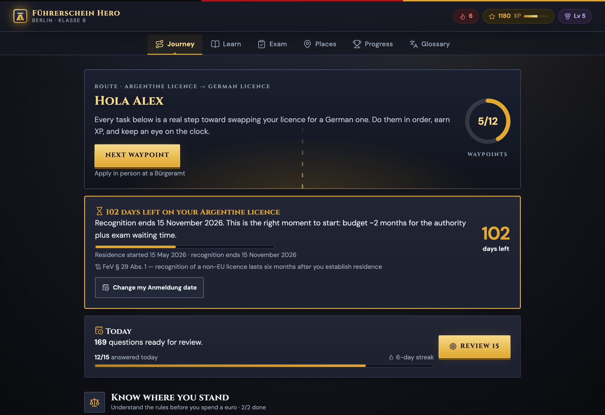

</div>

---

## 🧭 What this is

Moving to Germany with a non-EU driving licence starts a clock most people don't know is running.
Under **§ 29 Abs. 1 Satz 4 FeV** a foreign licence is recognised for **six months** after you
establish ordinary residence. Once that runs out, driving on it stops being a paperwork problem and
becomes *Fahren ohne Fahrerlaubnis*, a criminal offence under **§ 21 StVG**.

Meanwhile the conversion itself involves a first-aid course, an eye test, a certified translation, a
driving school, a *Prüfauftrag*, two exams, and an authority queue measured in weeks. Almost all of
it is described only in German, spread across a dozen unconnected websites.

**Führerschein Hero collapses that into one guided route**: what to do next, why it is legally
required, where to physically go in Berlin, how long you have left, and a full theory course in
English so the exam isn't the thing that stops you.

> [!IMPORTANT]
> This is a **study and planning aid, not legal advice**. Fees, waiting times and provider prices
> change. Always confirm your own case with LABO Berlin before spending money. See the
> [legal disclaimer](#legal-disclaimer).

### Who it's for

| You hold… | What the app does | Route |
|---|---|---|
| 🌍 **A non-EU licence** (Argentina is the worked example) | Tracks the six-month recognition deadline, walks the full *Umschreibung* under **§ 31 FeV**, and trains you for **both** mandatory exams | **5 phases, 12 tasks** |
| 🇪🇺 **An EU/EEA licence** | Explains why it stays valid with no exam, and the narrow cases where exchange becomes mandatory | 1 phase, 1 task |
| 🚫 **No licence at all** | Points at the *Ersterteilung* route from scratch, which shares the same exam machinery | 1 phase, 1 task |

> The non-EU conversion route is the one built out in depth. The other two are honest signposts
> rather than full guides. See [non-goals](#-non-goals--roadmap).

---

## ⚡ Quick start

There is **no build step and nothing to install**. It is hand-written ES modules and CSS, so you
serve `src/` with any static file server and open it.

```bash
git clone git@github.com:agusgonzaleznic/drive-berlin.git
cd drive-berlin
npm run dev            # python3 -m http.server 4173 -d src
# → open http://localhost:4173
```

That's it. No bundler, no transpiler, no framework, and no `npm install` needed to *run* it.
`npm install` only fetches `playwright-core` for the browser tests.

<details>
<summary><b>Other ways to serve it</b></summary>

```bash
npm run dev:node                  # npx serve -l 4173 src
python3 -m http.server 4173 -d src
npx http-server src -p 4173
php -S localhost:4173 -t src
```

Any static host works too. See [deployment](#-deployment).

**One requirement:** serve it over `http(s)://`, not `file://`. The `file:` origin blocks ES modules
and blocks `fetch()` of the JSON data files.

</details>

<details>
<summary><b>Does it work offline?</b></summary>

Almost entirely. All content, logic, icons, road-sign artwork, fonts and the Leaflet build are
local. Exactly **one** thing reaches the network, and it degrades gracefully instead of breaking:

| Resource | Host | If blocked |
|---|---|---|
| Map tiles | `tile.openstreetmap.org` | The map area shows a fallback. The place list, addresses and links still work |

Leaflet 1.9.4 is vendored in `src/assets/vendor/leaflet/`, and Cinzel and DM Sans in
`src/assets/fonts/`, so neither a CDN nor Google Fonts is contacted. If a font file is ever missing,
every rule still carries a local fallback stack. If Leaflet fails to load, `renderMap()` detects the
missing global and renders the list-only view.

No content, progress or personal data is ever fetched or sent.

</details>

---

## 📦 What's inside

<div align="center">

| | | |
|:--:|:--:|:--:|
| **169**<br>exam-style questions | **11**<br>theory modules | **12**<br>real-world tasks |
| **64**<br>glossary terms | **51**<br>examiner phrases | **35**<br>Berlin locations |
| **36**<br>road-sign SVGs | **17**<br>badges, **10** levels | **~59.5k**<br>words of sourced research |

</div>

### 🗺️ The journey: logistics, not just study

The conversion route is modelled as five phases you walk in order. Each task carries the statutory
basis, the real cost, what to physically bring, and where to go.

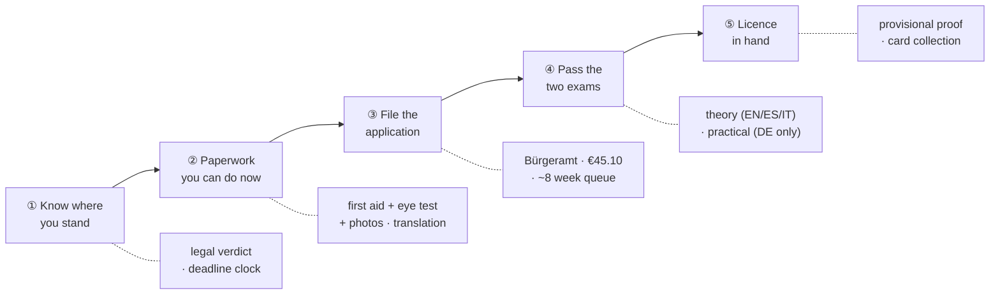

**The deadline clock is the feature that justifies the app.** Given an *Anmeldung* date it computes
the recognition end date from `src/data/rules.json` and escalates as it closes:

| Tier | Trigger | Framing |
|---|---|---|
| 🟢 `plan` | more than 150 days | Time to plan properly |
| 🟡 `urgent` | 90 days or fewer | Start now. The authority alone takes about 8 weeks |
| 🔴 `critical` | 30 days or fewer | You are about to lose the right to drive |

> [!NOTE]
> **`licenceClock()` returns `null` rather than guessing.** If the app cannot source a recognition
> period for your licence country, it says so and shows nothing. No invented deadline ever reaches
> the screen. See [accuracy](#-accuracy-the-part-that-actually-matters).

### 🎓 The theory course

Eleven modules written in English, each ending in a quiz drawn from the same pool as the mock exam.

| Module | Title | Questions |
|---|---|:--:|
| `m01-system` | The System & You | 15 |
| `m02-signs` | Traffic Signs & Road Markings | 15 |
| `m03-priority` | Right of Way & Intersections | 16 |
| `m04-speed` | Speed, Distance & Stopping | 16 |
| `m05-overtaking` | Overtaking, Turning & Manoeuvres | 15 |
| `m06-vulnerable` | People Outside Your Car | 15 |
| `m07-autobahn` | Autobahn & Country Roads | 15 |
| `m08-conditions` | Night, Weather & Hazard Perception | 15 |
| `m09-parking` | Parking, Stopping & Securing | 15 |
| `m10-vehicle` | Your Car: Tech, Load & Eco | 20 |
| `m11-berlin` | Berlin Survival Pack | 12 |

<div align="center">
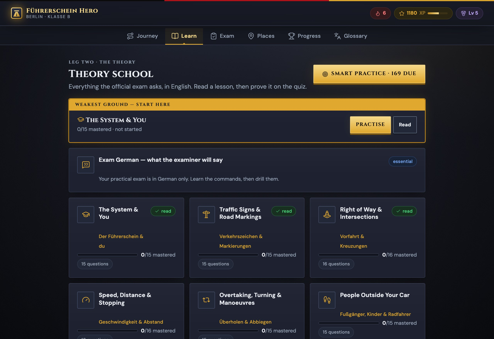 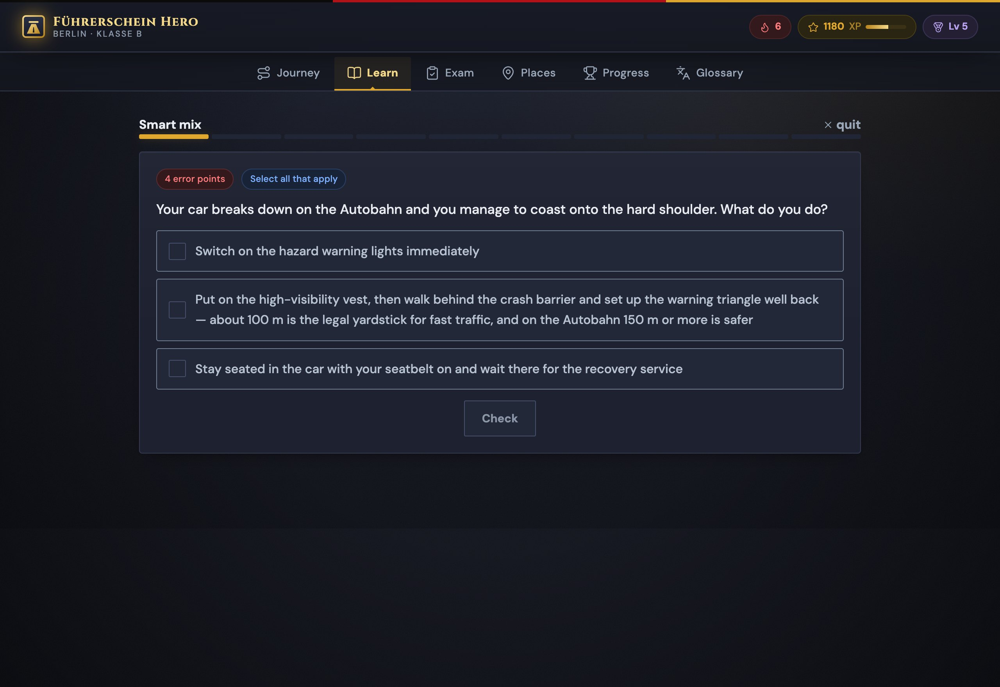
</div>

### 🔁 Spaced repetition (Leitner)

Every question carries a box. Right answers promote it, wrong answers reset it to box 0.

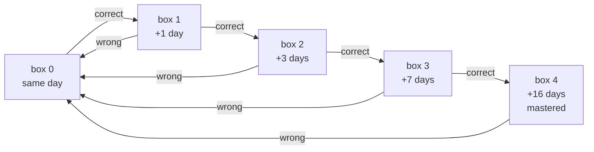

A practice session reserves **30 %** of its slots (`FRESH_RATIO`) for never-seen questions, so a
review backlog can never starve new coverage. The daily goal is **15** answers.

### 📋 The mock exam implements the *real* rules

Most free trainers just count a percentage. This one reproduces the official class B format,
including the rule that fails most people by surprise.

| Rule | Implementation |
|---|---|
| Question count | **30**, being 20 *Grundstoff* plus 10 *Zusatzstoff* |
| Scoring | **Error points** weighted 2 / 3 / 4 / 5 per question, not a percentage |
| Pass threshold | **10 error points or fewer** |
| ⚠️ Automatic fail | **Two wrong 5-point questions means failed**, even at 10 points or fewer |
| Multi-answer | A partially correct multi-answer question scores **zero**. All or nothing |

> [!WARNING]
> That automatic-fail rule is the single most commonly missed fact about the German theory exam.
> `scoreExam()` enforces it, and `tests/scoring.test.mjs` asserts it in both directions.

**Readiness is deliberately hard to satisfy.** `examReadiness()` weights module mastery **0.45**,
mock-exam performance **0.40** and pool coverage **0.15**. It then refuses to report "ready" without
at least **two passes in your last three attempts**, however high the arithmetic gets.

<div align="center">
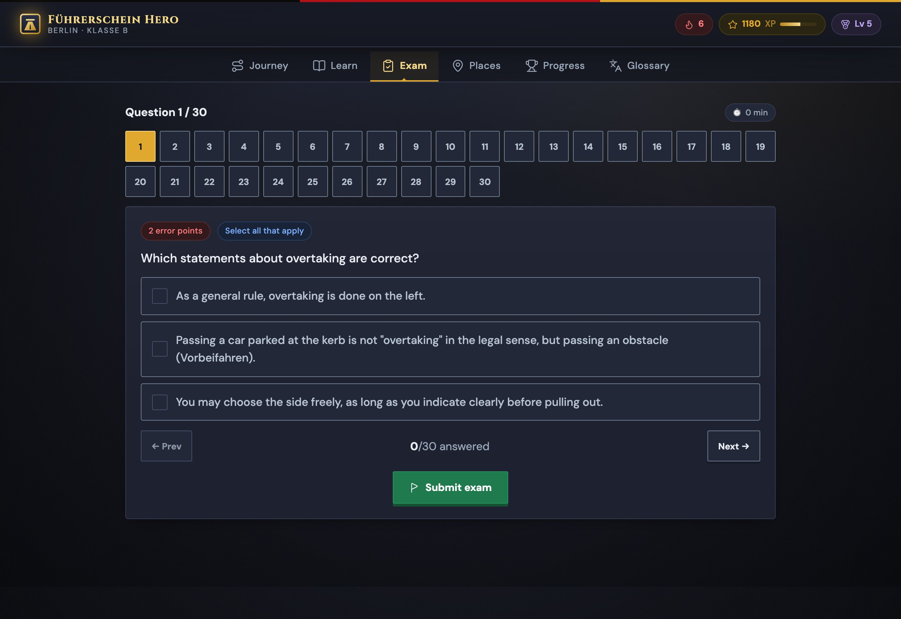 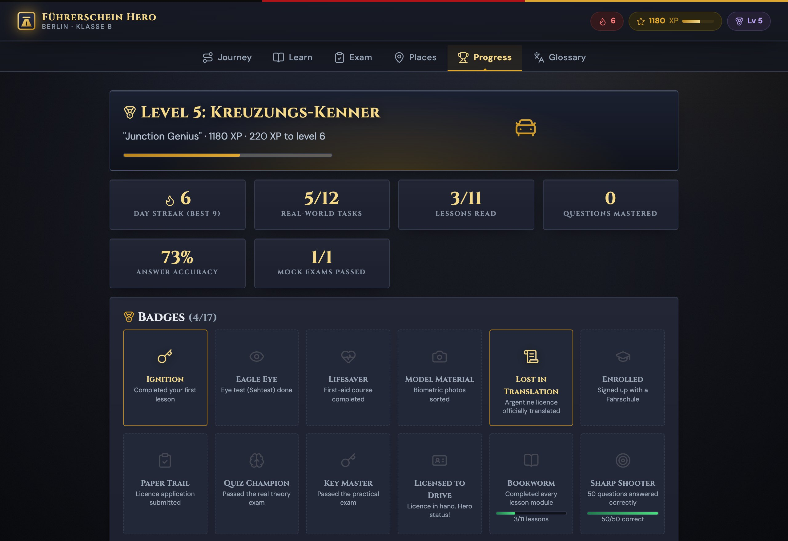
</div>

### 🗣️ Examiner German

The theory exam can be taken in **12 languages** (*Anlage 7 Nr. 1.3 FeV*, with English, Spanish and
Italian among them). **The practical cannot.** It is German only, and no interpreter is permitted,
so the app drills the roughly 50 phrases an examiner actually says, grouped by manoeuvre.

### 📍 Berlin places

35 verified locations on a Leaflet map with an accessible list fallback: free eye tests, English
first-aid courses, photo booths, *Bürgerämter*, DEKRA and TÜV *Prüfstellen*, and driving schools.

> **Geolocation is opt-in, used only to sort the list locally, and never stored or transmitted.**
> The default view is central Berlin.

<div align="center">
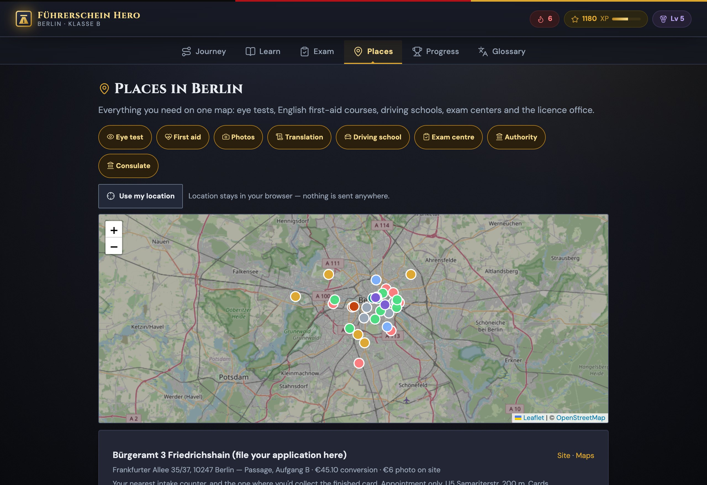 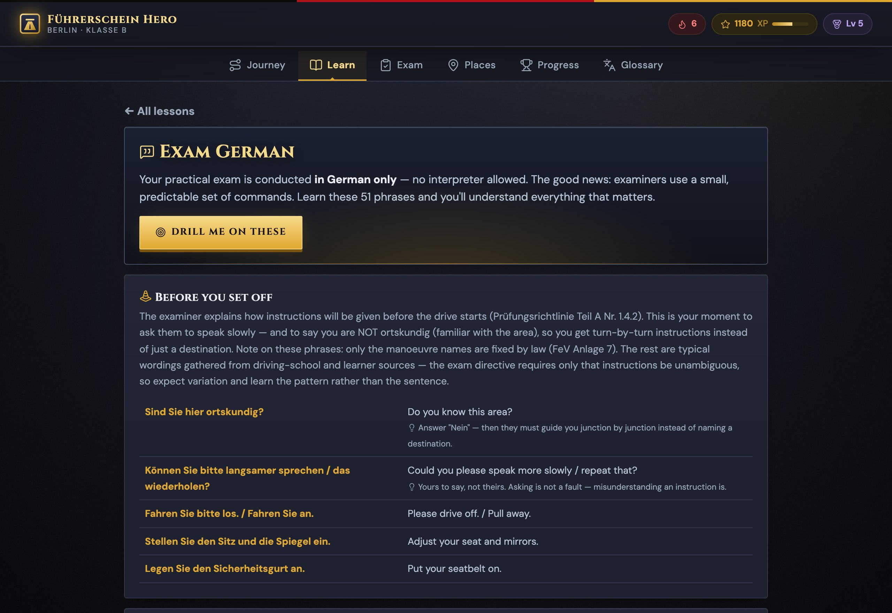
</div>

### 🏆 Gamification

XP for every lesson, correct answer, task and exam, across **10** levels with German driver titles.

| Lv | XP | Title | English |
|:--:|--:|---|---|
| 1 | 0 | Fußgänger | Pedestrian |
| 2 | 100 | Beifahrer | Passenger |
| 3 | 250 | Fahrschüler | Student Driver |
| 4 | 500 | Parkplatz-Profi | Parking-Lot Pro |
| 5 | 900 | Kreuzungs-Kenner | Junction Genius |
| 6 | 1400 | Stadtverkehr-Stratege | City-Traffic Strategist |
| 7 | 2000 | Landstraßen-Legende | Country-Road Legend |
| 8 | 2800 | Autobahn-Ass | Autobahn Ace |
| 9 | 3800 | Prüfungs-Profi | Exam Pro |
| 10 | 5000 | Führerschein-Held | Licence Hero |

There are also **17 badges**, all of them reachable, which a test asserts. Day streaks **decay
honestly** when you lapse instead of silently freezing, and a four-tier celebration hierarchy makes
passing a mock exam feel different from answering one question right. All animation respects
`prefers-reduced-motion`.

<div align="center">
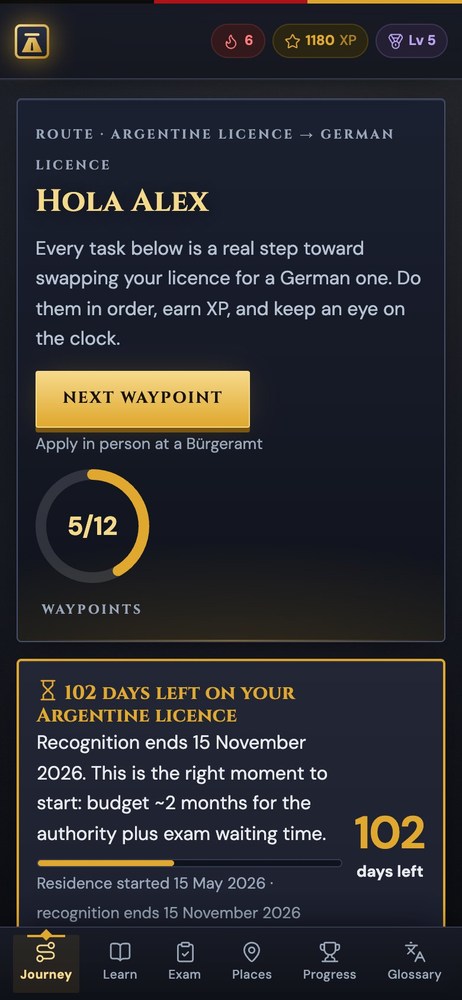
<br><sub>Responsive down to 390 px, measured rather than assumed</sub>
</div>

---

## 🎯 Accuracy: the part that actually matters

A study app that invents a legal deadline is worse than no app. The governing constraint of this
project was simple: **assume freely about implementation, never about content.**

### Sources-first hierarchy

Research ran under a strict precedence rule, and statutory claims had to quote the German text
verbatim rather than paraphrase it:

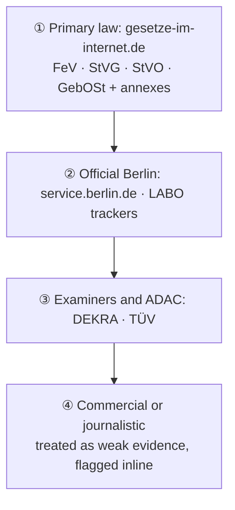

### Adversarial verification

Each research domain then went to a **separate verifier that had not seen the research and was
instructed to refute rather than confirm**. Its job was to return to the primary source, re-read it,
and record a per-claim verdict. Where the verifier corrected the researcher, the correction won.

That framing is what caught the errors that mattered:

| Claim that didn't survive | Reality |
|---|---|
| "You must convert within three years" | **No such rule exists** anywhere in FeV §§ 28–31 or Anlage 11. It is a widely repeated phantom deadline |
| First aid course €59.99 | **€72.99** online, or €82.99 cash on the day |
| Eye test costs a fee | **Fee abolished in 2019.** Free at major opticians |
| The *Prüfbescheinigung* lets you drive | **Dangerous misreading.** It does not |
| EU Directive 2025/2205 "changes nothing until 2029" | **Staggered** across 2027, 2028 and 2029 (Art. 29) |
| Convert in Italy instead | Barred by **§ 28 Abs. 4 Satz 1 Nr. 8 FeV** |

### The honesty rules, enforced in code

- **Legal periods live in [`src/data/rules.json`](src/data/rules.json)** and are never hardcoded in
  logic. If a period is absent, the UI shows nothing rather than a plausible number.
- Claims that could not be confirmed against a primary source are marked **⚠️ unverified** at the
  point of use rather than quietly dropped.
- **Not every verification pass completed.** Three research files have no verifier counterpart, and
  the documents say so explicitly instead of implying full coverage.
- `tests/data.test.mjs` asserts data integrity: every question has exactly one correct-answer set,
  every task references a real phase, and every badge is reachable.

The full methodology, and which claims a verifier confirmed, corrected or could not resolve, are
recorded in **[`docs/knowledge-base/`](docs/knowledge-base/)**. The agents' raw JSON output is kept
locally rather than committed, so the documents cite those filenames as provenance labels.

---

## 🔒 Security & privacy

There is no backend, no account, no analytics, no cookies and no error reporting. All state lives in
`localStorage`. That removes most of the usual attack surface, though not all of it, because the app
has an import button and builds every view from template literals.

Every finding below was reproduced before it was fixed, and each fix is pinned by an assertion in
`tests/security.test.mjs`. To report something new, read **[`SECURITY.md`](SECURITY.md)** first: it
sets out what is in scope, what is not, and what response to expect.

| Finding | Severity | Fix |
|---|---|---|
| **Prototype pollution** via progress import. `Object.assign(state, JSON.parse(json))` let `__proto__` through, verified empirically | High | `sanitizeState()` allowlist that never copies `__proto__`, `constructor` or `prototype` |
| **Type confusion** via import. `badges: "ignition"` made `.includes()` do substring matching, and `exams: {}` threw mid-render, blanking the screen with no recovery | High | Per-key coercion, clamped counts, capped collection and string sizes |
| **`javascript:` URLs** in data-driven `href`s. `esc()` escapes quotes but does not neutralise a URL scheme | Medium | `safeUrl()` scheme allowlist, which strips control characters first so `java\nscript:` cannot slip past |
| **Partial escaping** in `icon()`, `emblem()`, `flag()` and `glyph()` | Medium | Full `&<>"'` escaping in all four rendering primitives |
| **No CSP** | Medium | Strict policy. The app has *zero* inline `<script>`, so `script-src` is genuinely tight |
| **Third-party code from a CDN.** Leaflet came from `unpkg.com`, so a compromise there was arbitrary script in every visitor's browser. SRI pinned the bytes, but it could not remove the dependency | Medium | Leaflet 1.9.4 vendored into `src/assets/vendor/leaflet/`, byte-verified against the `sha384` hashes that used to pin it. `script-src` no longer names any external origin |
| **Google Fonts disclosed every visitor's IP address** to Google before a glyph was drawn, which LG München I held unlawful without consent (3 O 17493/20, January 2022), and which contradicted this app's own promise that nothing is uploaded anywhere | Medium | Cinzel and DM Sans vendored into `src/assets/fonts/` as woff2 subsets, so `font-src` is `'self'` |
| **Referrer leakage** to authority sites | Low | `no-referrer` document-wide, plus `rel="noopener noreferrer"` on every external link |

```
Content-Security-Policy:
  default-src 'self'; script-src 'self';
  style-src 'self' 'unsafe-inline';
  font-src 'self';
  img-src 'self' data: https://tile.openstreetmap.org https://*.tile.openstreetmap.org;
  connect-src 'self'; object-src 'none'; base-uri 'none'; form-action 'none'
```

`style-src` keeps `'unsafe-inline'` because the views set `style=""` on 127 elements; style injection
is far lower severity than script injection. Everything else is `'self'` or `'none'`, and the only
external origin left in the whole policy is the map tile host.

Two layers of test verify this. `tests/csp.mjs` drives real Chrome: **0 CSP violations**, Leaflet
initialises, tiles fetch, both font families load from this origin, and the only third-party origin
contacted is `tile.openstreetmap.org`. Because that suite needs system Chrome and therefore cannot
run in CI, `tests/security.test.mjs` re-asserts the same property by reading the files, so a
re-introduced CDN fails a pull request.

<details>
<summary><b>Three caveats worth reading</b></summary>

- **`style-src 'unsafe-inline'` is still needed**, because the views use `style=""` attributes
  throughout. Style injection cannot execute script under this CSP, so the payoff for removing it is
  low.
- **The review had one pair of eyes.** The five adversarial agent lenses intended for it failed twice
  on API capacity errors, so it was done directly instead: a mechanical sweep of all 475 template
  interpolations reaching `innerHTML`, plus a manual review of the import path, the network surface
  and the third-party dependency. That is worth stating plainly rather than implying more rigour than
  the review actually had.
- **Your exported progress file contains what you typed**, meaning your name, *Anmeldung* date and
  licence country, and the same data sits in `localStorage`. On a shared computer, anyone with the
  browser profile can read it. That is inherent to a local-first design.

</details>

---

## 🧪 Testing

Engine functions carry a `CONTRACT` JSDoc block stating what callers may rely on, and the test files
are written as the **specification** for those contracts. `tests/security.test.mjs` maps assertion
by assertion to the contract in `src/js/security.js`.

| Suite | What it covers | Result |
|---|---|:--:|
| `npm test` | Exam scoring, deadline maths, progress engine, data integrity, security primitives, first-party loading surface | **81 passed** |
| `test:browser` | All routes in real Chrome, a full mock exam, failing on any console error | **32 checks, 0 errors** |
| `test:course` | End-to-end walkthrough of the entire course | **~480 checks** |
| `test:a11y` | Keyboard navigation and `prefers-reduced-motion` | **8 passed** |
| `test:contrast` | Measured WCAG 1.4.3 ratios and touch-target sizes on every screen | all text passes |
| `test:csp` | CSP violations, vendored Leaflet and fonts, tile loading, third-party origins | **0 violations** |
| `emojiscan` | Asserts no emoji leaked back into the rendered UI | clean |

```bash
npm test              # unit, no browser needed
npm run test:all      # everything, including the full course walkthrough
```

The course-walkthrough total moves by a few checks between runs, because the mock exam composes a
fresh 30-question paper each time and the number of per-question assertions varies with it. Any
non-zero `failed` count is a real failure.

Browser suites drive **system Chrome via `playwright-core`**, so there is no 300 MB browser
download. They also disable the HTTP cache over CDP, because stale ES modules once made a fixed bug
look unfixed.

<details>
<summary><b>Bugs these tests exist because of</b></summary>

Each of these shipped once and is now pinned by an assertion:

- `toISOString()` for "today" reads as the **previous UTC day** west of Greenwich, so a streak could
  break at 01:00 local time. Fixed with a local `isoDay()`, and the same bug was later found again
  in `state.js`.
- The exam navigator applied `current` **XOR** `answered`, so the cell you were standing on never
  looked answered. Now they co-occur, with a dot marker and an `aria-label`.
- A long `white-space: nowrap` pill made a card unable to shrink below its min-content width, giving
  **18 px of horizontal overflow** at 390 px.
- Opacity-based `:disabled` styling measured **2.78:1**, below AA. Buttons now have an explicit
  disabled skin.
- Three times the *test* was wrong rather than the code, including a question where all three
  options are legitimately correct. Verifying which side is wrong before "fixing" matters.

</details>

---

<a id="architecture"></a>

## 🏗️ Architecture

Deliberately boring: no framework, no build, no state library. The whole app is **3,131 lines of JS
across 23 modules**, **810 lines of CSS** and a **74-line** HTML shell.

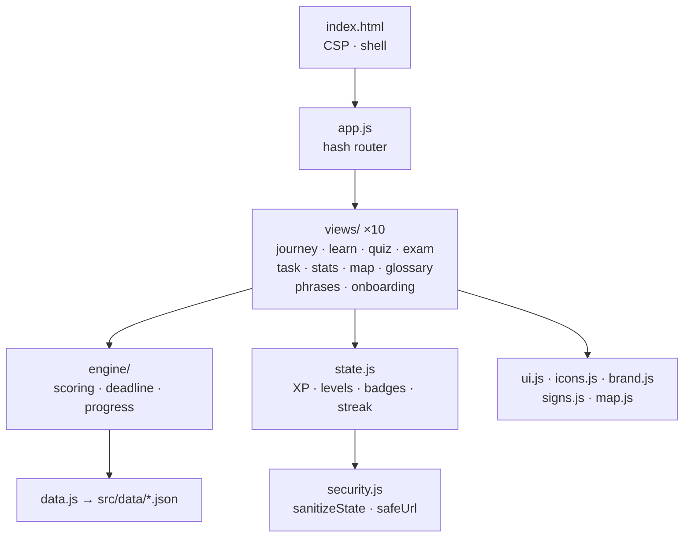

```
src/
├── index.html              # single entry: CSP, vendored asset links, app shell
├── css/  base.css          # design tokens, ground, type, chrome
│         components.css    # cards, buttons, pills, tables, exam grid
├── js/   app.js            # hash router, chrome, scroll + focus memory
│         state.js          # persistence, XP, levels, badges, streaks
│         security.js       # sanitizeState(), safeUrl(), both CONTRACT-documented
│         engine/           # pure logic, no DOM: scoring · deadline · progress
│         views/            # 10 route renderers
│         ui.js icons.js brand.js glyphs.js signs.js map.js
├── data/ journey.json      # 3 paths, phases, tasks
│         modules/          # 11 lesson modules and 169 questions
│         rules.json        # legal periods, the single source for deadlines
│         locations.json glossary.json phrases.json
└── assets/icons/           # 84 local Lucide SVGs plus licence
docs/
├── knowledge-base/         # 8 sourced documents (~59.5k words)
└── assets/screenshots/
tests/                      # 5 unit suites, 6 browser suites
scripts/                    # gen-icons.mjs, gen-screenshots.mjs
```

| Layer | Choice | Why |
|---|---|---|
| Markup | Hand-written HTML | One 74-line shell, with views rendering into `#view` |
| Styling | Plain CSS and custom properties | Token-driven dark theme, no preprocessor |
| Logic | Vanilla ES modules | Runs unbuilt in every modern browser |
| State | `localStorage`, one key | No account, no server, no sync |
| Icons | [Lucide](https://lucide.dev), 84 SVGs, vendored | ISC licensed, local, no CDN |
| Signs | 36 hand-drawn inline SVGs | Real German sign colours, never tokenised |
| Type | Cinzel and DM Sans, vendored woff2 | Self-hosted, so no Google Fonts request. Display face restricted to headings, since German compounds wrap badly |
| Maps | Leaflet 1.9.4, vendored, with OSM tiles | No CDN, degrades to a list |
| Tests | `node --test` and `playwright-core` | One dev dependency, total |

**Accessibility is measured, not claimed.** Contrast ratios and touch-target sizes are computed in a
real browser on every screen. A dedicated `--line-control` token exists solely so that focusable
control borders clear 3:1 (WCAG 1.4.11).

---

## 📚 Documentation

| Document | What it is |
|---|---|
| [`docs/knowledge-base/`](docs/knowledge-base/) | The sourced research: 8 documents, ~59.5k words, with the methodology and per-claim verifier coverage recorded inline |
| [`SECURITY.md`](SECURITY.md) | Security policy: what is in scope, how to report a vulnerability, and what response to expect |

<details>
<summary><b>Knowledge-base contents</b></summary>

| File | Covers |
|---|---|
| `argentina-conversion.md` | The full non-EU conversion route: legal core, deadlines, Berlin procedure, exams, costs, alternatives |
| `prerequisites.md` | Eye test, first aid, biometric photos. The law, Berlin providers, prices, and the smartest order |
| `theory-exam.md` | Format, scoring, the frozen catalogue, the 12 exam languages, fees, retakes |
| `practical-exam.md` | The 55-minute format, *Grundfahraufgaben*, instant-fail versus minor faults, the German-only rule |
| `costs-and-driving-schools.md` | Conversion versus full licence costs, official fees, choosing a Berlin school |
| `eu-licence-rules.md` | § 28 FeV, the 185-day residence rule, Directive (EU) 2025/2205 |
| `first-licence-process.md` | *Ersterteilung* from scratch, kept for the shared exam machinery |
| `README.md` | Scenario, methodology, coverage gaps, caveats |

</details>

---

## 🚀 Deployment

The static files are safe to serve as-is. Two protections can only come from response headers:

```
Content-Security-Policy: frame-ancestors 'none'
X-Frame-Options: DENY
X-Content-Type-Options: nosniff
```

A `<meta>` tag cannot set `frame-ancestors` by design, which is why it isn't in the document CSP.
**Serve over HTTPS** so that the CSP cannot be stripped in transit.

| Host | Headers? | Notes |
|---|:--:|---|
| **Cloudflare Pages** | ✅ | `_headers` file. Recommended |
| **Netlify** | ✅ | `_headers` or `netlify.toml` |
| **Vercel** | ✅ | `vercel.json` → `headers` |
| **Nginx / Caddy** | ✅ | `add_header` / `header` |
| **GitHub Pages** | ❌ | Cannot set custom headers, so `frame-ancestors` and `X-Frame-Options` are unavailable |

The publish root is **`src/`**. `npm run build` exists only to say there is nothing to build.

---

## 🧱 Non-goals & roadmap

**Deliberately not doing:**

- No backend, accounts or cloud sync. Local-first is the privacy guarantee, not a limitation
- No official question catalogue. The real one is licensed, so these are original questions written
  to the same format and difficulty
- No German UI. The entire point is English-language access
- No `localStorage` encryption. It would need a passphrase, against a threat that already implies
  control of the browser profile

**Known gaps, stated honestly:**

| Gap | Status |
|---|---|
| EU and first-licence routes are signposts, not full guides | Non-EU conversion is the built-out route |
| 3 research files have no independent verifier pass | Marked ⚠️ unverified at each point of use |
| The security review had a single pair of eyes | Stated plainly under [security & privacy](#-security--privacy) rather than glossed over |
| Bottom tab targets are 40×49 px | Clears WCAG 2.5.8 (24 px), below the 44 px comfort guideline |
| Light theme | 14 hardcoded values block a clean token flip, and sign colours must never be tokenised |

---

## 💛 Support this project

It is free, it stays free, and there is nothing to upsell: no ads, no accounts, no tracking. I built
it because I needed it, and the research underneath took considerably longer than the code did.

Three things help, in ascending order of effort:

- **Star the repo.** It is the only signal that tells the next person in this situation that any of
  this exists.
- **Open an issue when a number is wrong.** Fees, waiting times and provider prices drift constantly.
  A corrected figure *with its primary source* is the most useful contribution anyone can make here.
- **Drop a coffee on Ko-fi, or sponsor on GitHub**, if this saved you a wasted trip to LABO. Ko-fi
  is a one-off, GitHub Sponsors can be monthly, and both accept a custom amount. Re-verifying legal claims
  against primary sources is the slow, recurring, genuinely unglamorous part of keeping a project like
  this honest.

<div align="center">
<br>

[](https://ko-fi.com/agusgonzaleznic)
[](https://github.com/sponsors/agusgonzaleznic)
<br>
[](https://agusgonzaleznic.com)
[](https://github.com/agusgonzaleznic)
[](https://www.linkedin.com/in/agusgonzaleznic)

<br>

<sub>Built in Berlin by <b>Agustin Gonzalez Nicolini</b>. I work on engineering leadership and write
about it at <a href="https://agusgonzaleznic.com">agusgonzaleznic.com</a>.</sub>

</div>

---

<a id="legal-disclaimer"></a>

## ⚖️ Legal disclaimer

**This is not legal advice.** It is a study and planning aid assembled from public sources for one
documented scenario: a non-EU (Argentine) licence holder resident in Berlin.

- Fees, waiting times, provider prices and authority backlogs **change constantly**. Read every euro
  figure and processing time as *check before you go*.
- The reform expected around early 2027 was still a **draft** when this was written. Do not plan
  around it.
- **Only LABO Berlin**, the *Fahrerlaubnisbehörde* of the Landesamt für Bürger- und
  Ordnungsangelegenheiten, can tell you how your specific document will be treated. Confirm your own
  case before spending money or making irreversible decisions.
- Statutory references were read on the dates stamped in each document. Law changes, so re-check the
  linked primary source.

---

## 📄 Licence & attribution

**Open source, and attribution is required.** Because this repo is mostly prose wrapped around some
code, each part is licensed with the tool that fits it:

| Part | Paths | Licence |
|---|---|---|
| **Software** | `src/index.html` · `src/favicon.svg` · `src/css/**` · `src/js/**` · `scripts/**` · `tests/**` | [MIT](LICENSE) |
| **Content**, meaning the research, lessons, questions, glossary, phrases and locations | `docs/**` · `src/data/**` | [CC BY 4.0](LICENSE-CONTENT) |

You can use, modify and sell derivatives of both, commercial use included. **You must credit me.**
MIT requires the copyright notice to travel with the code. CC BY 4.0 §3(a) additionally requires
that you name the creator, link the licence, and **state whether you changed anything**.

Reusing the content? This satisfies it:

```
Content adapted from "Führerschein Hero" by Agustin Gonzalez Nicolini
(https://github.com/agusgonzaleznic/drive-berlin),
licensed under CC BY 4.0 (https://creativecommons.org/licenses/by/4.0/).
Changes were made.
```

> [!CAUTION]
> If you republish the content, **re-verify it against the primary sources first.** Every legal and
> commercial figure was accurate only on the date stamped in its document, and both licences
> disclaim all warranties. Shipping a stale deadline to someone who then loses the right to drive is
> the failure mode this project was built to avoid.

See [`NOTICE`](NOTICE) for the authoritative per-path breakdown.

### Third-party material

The following is not covered by either licence above. It keeps its own terms, and nothing here
relicenses it:

| Asset | Licence |
|---|---|
| [Lucide](https://lucide.dev) icons (84 vendored SVGs) | ISC, see [`src/assets/icons/LICENSE.lucide`](src/assets/icons/LICENSE.lucide) |
| [Cinzel](https://fonts.google.com/specimen/Cinzel), [DM Sans](https://fonts.google.com/specimen/DM+Sans), vendored woff2 | SIL Open Font License 1.1, see [`src/assets/fonts/`](src/assets/fonts/) |
| [Leaflet](https://leafletjs.com) 1.9.4, vendored | BSD-2-Clause, see [`src/assets/vendor/leaflet/LICENSE.leaflet`](src/assets/vendor/leaflet/LICENSE.leaflet) |
| Map tiles | © [OpenStreetMap](https://www.openstreetmap.org/copyright) contributors, ODbL |
| Emblem, road signs, all other artwork | Original to this project |

German statutory text quoted from [gesetze-im-internet.de](https://www.gesetze-im-internet.de)
(*FeV*, *StVG*, *StVO*, *GebOSt*) is an official work under § 5 UrhG and is not
copyright-protected.

<div align="center">
<br>

<br>
<sub><b>Gute Fahrt.</b></sub>
</div>
